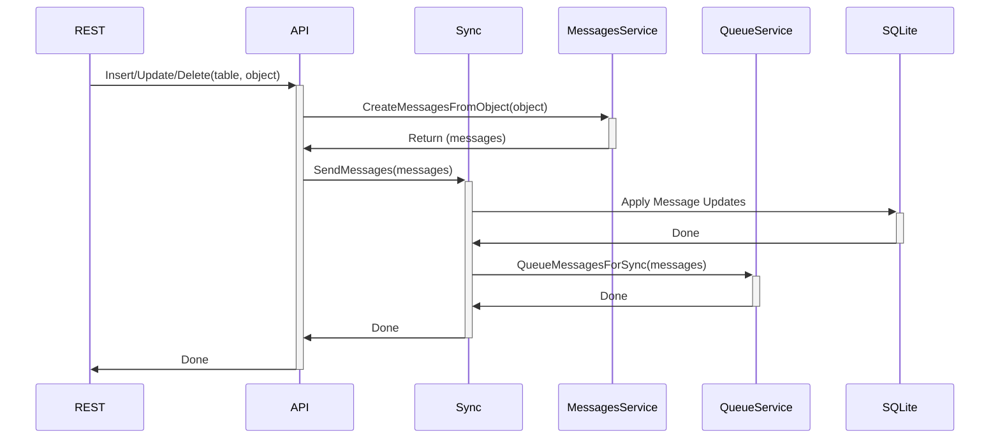
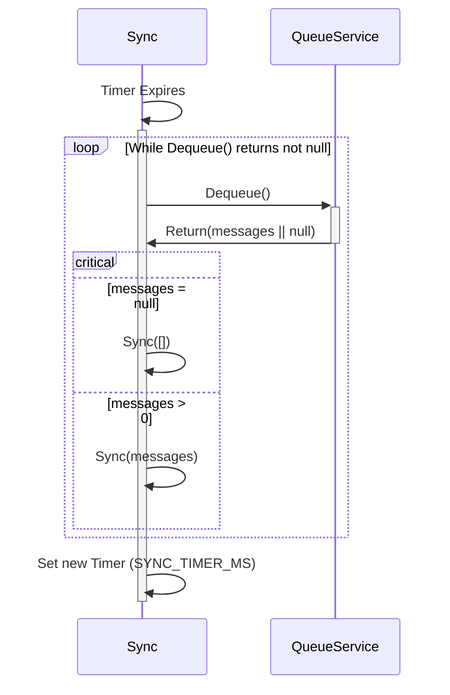
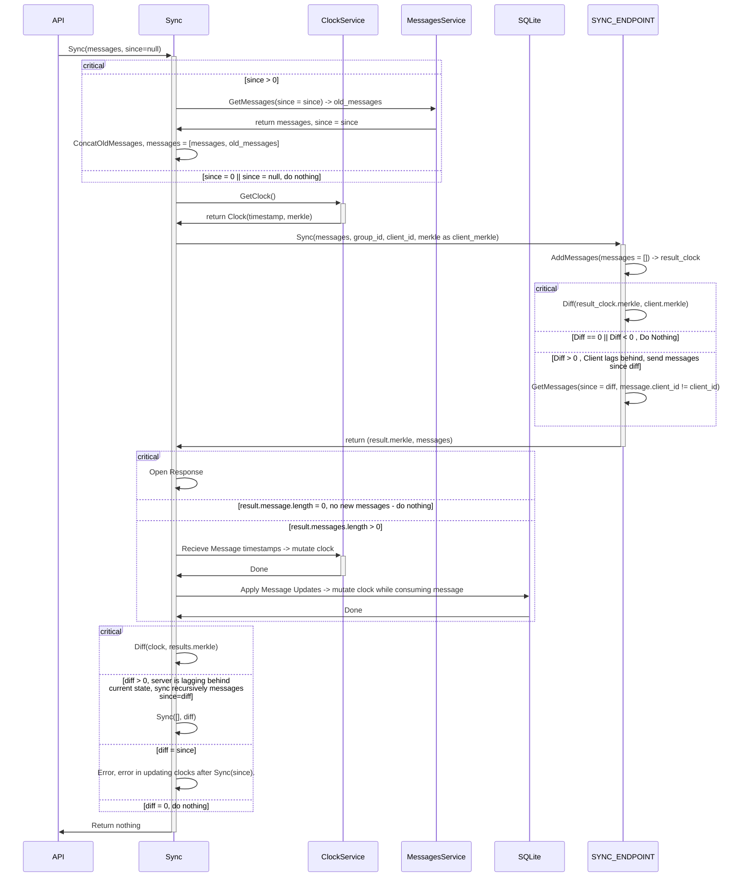

## NestJS CRDT Store - SQLITE

## Description

An SQLite API Wrapper that implements `Hybrid-Logical-Clocks (HLC)` in combination with `Conflict-Free-Replicated-Data-Type (CRDT)` to implement non blocking writes and sync to SQLite.

This application primariy uses `drizzle-orm` to interface with SQLite.

## Usage

### TL;DR

1. Install dependencies.

   ```bash
   yarn
   ```

2. Build the application.

   ```bash
   yarn build
   ```

3. Define a port and SQLite File location and start the server start the server.

   ```
   PORT=3000 DB_SQLITE_FILE=db/sql-1.sqlite node dist/main.js
   ```

### REST API

This server exposes a rest api that is validated against schema in `src/schema` using `drizzle-zod`.

#### Post /store/:table

```bash
curl --location 'http://localhost:3060/store/contacts' \
--request POST \
--header 'Content-Type: application/json' \
--data '{
    "data": {
        "first_name": "Ralph",
        "middle_name": "",
        "last_name": "Ellis",
        "date_of_birth": "08/29/43"
    }
}'
```

#### Patch /store/:table/:id

```bash
curl --location 'http://localhost:3060/store/contacts/01JAR2HPE7JJS1HYQZ7FYK0S4D' \
--request PATCH \
--header 'Content-Type: application/json' \
--data '{
    "data": {
        "first_name": "Ralph",
        "middle_name": "",
        "last_name": "Ellis",
        "date_of_birth": "08/29/43"
    }
}'
```

#### Delete /store/:table/:id

```bash
curl --location 'http://localhost:3060/store/contacts/01JAR2HPE7JJS1HYQZ7FYK0S4D' \
--request DELETE \
--header 'Content-Type: application/json'
```

#### Get /store/:table/:id

```bash
curl --location 'http://localhost:3060/store/contacts/01JAR2HPE7JJS1HYQZ7FYK0S4D'
```

#### Get /store/:table

- With all fields.

  ```bash
  curl --location --request GET 'http://localhost:3060/store/contacts'
  ```

- With plucked fields

  ```bash
  curl --location --request GET 'http://localhost:3060/store/contacts?pluck=first_name'
  ```

### Docker

This project comes with docker batteries built in. You can modify the included `docker-compose.yml` and `dockerfile` and run the application using docker.

Build the image with the included docker-compose.yml and dockerfile

```bash
docker compose build

```

Run with Docker using compose.

```bash
docker compose up
```

## Configuration

### Configuration Items

<table>
  <thead>
    <tr>
      <th>Key<th>
      <th>Type<th>
      <th>Example<th>
      <th>Description<th>
    </tr>
  </thead>
  <tbody>
     <tr>
      <td>PORT<td>
      <td>string<td>
      <td>3060<td>
      <td>Port where the application will listen on<td>
    </tr>
     <tr>
      <td>DB_SQLITE_FILE<td>
      <td>string<td>
      <td>sql/sql.sqlite<td>
      <td>Location of the SQLite File<td>
    </tr>
    <tr>
      <td>SYNC_ENABLED<td>
      <td>string<td>
      <td>true<td>
      <td>Enable sync to remote server.<td>
    </tr>
     <tr>
      <td>DEFAULT_ORGANIZATION_ID<td>
      <td>string<td>
      <td>01JBHKXHYSKPP247HZZWHA3JCT<td>
      <td>Default ID of the organization that is created on initialization<td>
    </tr>
    <tr>
      <td>DEFAULT_ORGANIZATION_NAME<td>
      <td>string<td>
      <td>Super Organization<td>
      <td>Default Name of the organization that is created on initialization<td>
    </tr>
    <tr>
      <td>DEFAULT_ORGANIZATION_ADMIN_EMAIL<td>
      <td>string<td>
      <td>admin@example.com<td>
      <td>Email of the first admin account under that organization<td>
    </tr>
        <tr>
      <td>DEFAULT_ORGANIZATION_ADMIN_PASSWORD<td>
      <td>string<td>
      <td>ch@ng3m3Pl3@s3!!<td>
      <td>Password of the first admin account under that organization<td>
    </tr>
    <tr>
      <td>GROUP_ID<td>
      <td>string<td>
      <td>my_group<td>
      <td>CRDT Group ID, replicate and consume messages from the same group id.<td>
    </tr>
    <tr>
      <td>SYNC_TIMER_MS<td>
      <td>string<td>
      <td>30000<td>
      <td>Used to time the background sync process. Performs sync at this period.<td>
    </tr>
    <tr>
      <td>DATABASE<td>
      <td>string<td>
      <td>Test<td>
      <td>Name of the Database<td>
    </tr>
  </tbody>
<table>

### Initial Configuration

Initial Configuration is loaded at run time from corresponding environment variables.

### Runtime Configuration

Runtime configuration is get looked-up from the table `config_sync`. _Note: config_sync table is not replicated to other instance_

### Configuration Updates

There are two tables that hold configuration:

- `config_sync` - locally isolated, configures syncing behaviour
- `config_application` - globally replicated, application key/value store

#### Local Sync Config (`config_sync`)

- See all configurations

  ```bash
  curl --location --request GET 'http://localhost:3060/config/config_sync'
  ```

- Update a configuration
  ```bash
  curl --location 'http://localhost:3060/store/config/config_sync/TEST_CONFIG' \
  --request POST \
  --header 'Content-Type: application/json' \
  --data '{
    "data": {
      "value": "foo",
      "type": "string"
    }
  }'
  ```

#### Global Configurations (`config_applications`)

Global configurations can be accessed as with any resources. _see [Rest API](#rest-api)_

## Schema

All schema are defined inside `src/schema` directory.

Schema is strictly enforced by `drizze-zod` at mutation attempt in REST API.

### Replication

As all data points are globally replicated, it is expected that other peers that will recieve the replication messages implement the same version of schema.

If you wish to develop new schema, please ensure that the `GROUP_ID` configuration communicates the schema that you are using to prevent other peers from recieving updated messages that are not from the same schema. _( e.g GROUP_ID=application_name-schema-v2)_

Just as data points are replicated, schema is also replicated - therefore, existing types for a schema must be immutable and cannot change types once committed and replicated.

## Diagrams

### Sequence

#### Mutations



### Background Sync



#### Sync

This sequence diagram explains the store behaviour of how it will call the `SYNC_ENDPOINT` to attempt synchronization.



## Development

1. Install dependencies

   ```bash
   yarn
   ```

2. Generate Schema
   ```bash
   yarn drizzle:generate
   ```
3. Migrate Database to schema.
   ```bash
   yarn drizzle:migrate
   ```
4. Run Dev Server
   ```bash
   yarn start:dev
   ```
