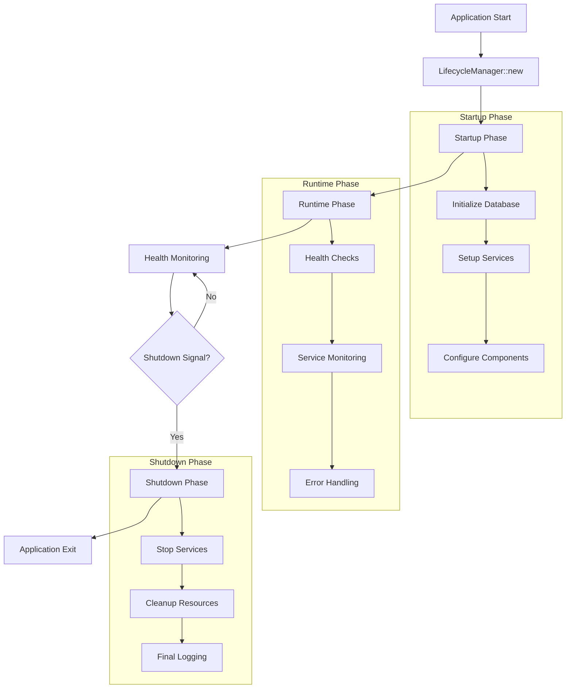

# CRDT Rust Implementation

A Rust implementation of Conflict-Free Replicated Data Types (CRDTs) using Merkle trees and Hybrid Logical Clocks.

## Project Structure

```plaintext
crdt-workspace/
├── .env-sample                    # Environment configuration template
├── .gitignore                     # Git ignore patterns
├── Cargo.toml                     # Workspace configuration
├── Makefile                       # Build automation and development commands
├── README.md                      # Project documentation
├── bin/store/                     # CRDT Store application
│   ├── Cargo.toml
│   ├── Dockerfile
│   ├── docker-compose.yml         # Development services (TimescaleDB, Redis)
│   ├── migrations/                # Database migrations
│   └── src/
│       ├── builders/              # Code generation and build tools
│       │   ├── generator/         # Schema and proto generators
│       │   └── templates/         # Code generation templates
│       ├── config/                # Configuration management
│       │   ├── core.rs            # Centralized environment configuration (EnvConfig)
│       │   └── mod.rs             # Configuration module exports
│       ├── constants/             # Application constants and paths
│       ├── controllers/           # gRPC and API controllers
│       ├── database/              # Database schema and operations
│       │   └── schema/            # Database schema definitions
│       │       ├── tables/        # Individual table definitions
│       │       └── sql/           # SQL scripts
│       ├── generated/             # Auto-generated code (do not edit manually)
│       │   ├── models/            # Generated data models
│       │   ├── proto/             # Generated protobuf files
│       │   └── schema.rs          # Generated database schema
│       ├── initializers/          # Application initialization
│       ├── lifecycle/             # Application lifecycle management
│       │   ├── manager.rs         # Main lifecycle orchestrator
│       │   ├── startup.rs         # Startup phase management
│       │   ├── runtime.rs         # Runtime phase management
│       │   ├── shutdown.rs        # Shutdown phase management
│       │   ├── health_service.rs  # Health monitoring service
│       │   └── logging.rs         # Lifecycle logging system
│       ├── middlewares/           # Request/response middleware
│       ├── providers/             # Service providers
│       ├── routers/               # HTTP route handlers
│       ├── structs/               # Data structures and configuration
│       └── utils/                 # Utility functions
├── libs/                          # Shared libraries
│   ├── hlc/                      # Hybrid Logical Clock implementation
│   └── merkle/                   # Merkle Tree implementation
├── docs/                          # Documentation and diagrams
└── scripts/                       # Development and deployment scripts
```

### Lifecycle Management System

The application uses a comprehensive lifecycle management system located in `bin/store/src/lifecycle/` that orchestrates all phases of the application's execution:

- **`manager.rs`** - Main lifecycle orchestrator that coordinates all components
- **`startup.rs`** - Handles application initialization and startup procedures
- **`runtime.rs`** - Manages the main execution phase and health monitoring
- **`shutdown.rs`** - Coordinates graceful shutdown procedures
- **`state.rs`** - Manages application state transitions and component status
- **`health_service.rs`** - Provides health monitoring and reporting capabilities
- **`logging.rs`** - Specialized logging system for lifecycle events

#### Lifecycle Phases


```mermaid
graph TD
    A[Application Start] --> B[LifecycleManager::new]
    B --> C[Startup Phase]
    C --> D[Runtime Phase]
    D --> E[Health Monitoring]
    E --> F{Shutdown Signal?}
    F -->|No| E
    F -->|Yes| G[Shutdown Phase]
    G --> H[Application Exit]
    
    subgraph "Startup Phase"
        C1[Initialize Database]
        C2[Setup Services]
        C3[Configure Components]
        C --> C1 --> C2 --> C3
    end
    
    subgraph "Runtime Phase"
        D1[Health Checks]
        D2[Service Monitoring]
        D3[Error Handling]
        D --> D1 --> D2 --> D3
    end
    
    subgraph "Shutdown Phase"
        G1[Stop Services]
        G2[Cleanup Resources]
        G3[Final Logging]
        G --> G1 --> G2 --> G3
    end
```

## Prerequisites

Before running the installation, ensure you have the following system requirements:

### Required System Tools

- **make** - Build automation tool (required to run the installer)
- **curl** or **wget** - For downloading dependencies
- **git** - Version control system
- **sudo privileges** - Required for system package installation

### Operating System Support

- **macOS** - Homebrew will be used for package management
- **Linux** - Supports apt-get (Ubuntu/Debian), yum (RHEL/CentOS), and pacman (Arch)
- **Windows** - Chocolatey will be used for package management
- **Docker** - For containerized development (optional)

### Rust Version Requirement

- **Rust 1.91.0** - Specific version required for compatibility
  - The installer will automatically install and verify this version
  - If you have a different version installed, the installer will prompt you to update
  - Manual installation: `rustup install 1.91.0 && rustup default 1.91.0`

### Docker Compose

- **Docker Compose file** - Located at `docker-compose.yml`
- **Services** - Provides TimescaleDB and Redis services for development
- **Usage** - Use `make docker-compose-up` to start services
- **Prerequisites** - Docker Desktop must be installed and running
- **Error Handling** - Automatic Docker daemon checks with clear error messages

## Quick Setup

### Step 1: Clone the Repository

First, clone the project repository:

```bash
git clone https://gitlab.platform.dnadev.net/platform/db/crdt/rust/crdt-workspace.git
cd crdt-workspace
```

### Step 2: Configure Git Remote (Optional)

If you plan to push changes to your own repository, update the git remote URL:

```bash
# Remove the original remote
git remote remove origin

# Add your own repository as the new origin
git remote add origin <your-repository-url>

# Verify the new remote
git remote -v
```

### Step 3: Environment Configuration ( Only run this for development purposes )

Set up your environment variables by copying the sample file:

```bash
cp .env-sample .env
```

Then edit the `.env` file to configure your specific settings (database URLs, API keys, etc.).

NOTE: Do not revise .env-store and .env-sync-server files. They are used for internal purposes.

### Step 4: One-Command Installation ( Only run this for development purposes )

🚀 **After setting up the environment, install the entire project with just one command:**

```bash
make install
```

**Note for Windows users:** The installer will automatically detect your Windows environment and use PowerShell with Chocolatey for package management. Ensure you have administrator privileges if prompted.

This will automatically:

- **Set up environment** by copying `.env-sample` to `.env`
- **Install Rust 1.91.0** (rustc, cargo, rustup) with version verification
- **Install PostgreSQL** database server (version 14 on Windows, latest on macOS/Linux) - TimescaleDB extension needs to be added separately
- **Install Cargo tools**: cargo-make, cargo-watch, diesel_cli
- **Install Protocol Buffers** compiler
- **Setup Git hooks** for development workflow
- **Configure environment** and dependencies
- **Install platform-specific package managers** (Homebrew on macOS, Chocolatey on Windows)
- **Start Docker Compose services** (TimescaleDB and Redis) for development with automatic Docker daemon checks and comprehensive error handling
- **Detect platform** and use appropriate package manager

### Verify Installation

After installation, verify everything is working on any supported platform:

```bash
make verify-install
```

This command will check:

- Rust 1.91.0 installation and version
- PostgreSQL server availability (TimescaleDB extension should be installed separately)
- Required Cargo tools (cargo-make, cargo-watch, diesel_cli)
- Platform-specific dependencies

### Start Development

🚀 **Start the store in development mode:**

```bash
# clean up all the tables, and records in the timescale db
# run this command only once, or when you want to reset the db
make store-clean-setup

# run the store
make store
```
## Getting Started (Manual Setup)
## High‑Load and Backpressure Guide
- For how the system behaves under pressure, where backpressure is applied, and how to tune environment variables for stable high‑throughput operation, see:
  - docs/High-Load-Resilience.md


1. Clone the repository:


   ```bash
   git clone <your-repository-url>
   cd crdt-workspace
   ```

2. Install dependencies:

   ```bash
   make install
   ```

3. Start store in development mode:

   ```bash
   make store
   ```

## Available Make Commands

The project includes a comprehensive Makefile with the following commands:

### Setup & Installation

- `make install` - One-command installer for all dependencies (auto-detects macOS/Linux/Windows)
- `make install-macos` - Install dependencies specifically for macOS with Rust 1.91.0
- `make install-linux` - Install dependencies specifically for Linux with Rust 1.91.0
- `make install-windows` - Install dependencies specifically for Windows with Rust 1.91.0
- `make verify-install` - Verify that all required tools are installed (cross-platform)

### Development
- `make store` - Run the store only and make sure all rust docker containers are up and running

### Store Generators

Code generation is handled by the standalone `store-generator` crate. Use these Makefile targets:

- `make store-generator-schema` - Generate schema, migrations, and models
- `make store-generator-proto` - Generate proto, gRPC controller, and table enum

### Database Management

- `make db-migrate-generate NAME=migration_name` - Generate new migration
- `make db-migrate-up` - Run database migrations
- `make db-migrate-revert` - Revert last migration

### Git & Version Control

- `make git-cleanup` - Clean up local branches that no longer exist on remote

### Docker Compose Commands

- `make docker-compose-up` - Start TimescaleDB and Redis services using Docker Compose
- `make docker-compose-down` - Stop and remove Docker Compose services
- `make docker-compose-restart` - Restart Docker Compose services
- `make docker-compose-logs` - Show logs from Docker Compose services
- `make docker-compose-ps` - Show status of Docker Compose services

### Utilities

- `make clean` - Clean build artifacts
- `make help` - Show all available commands

For a complete list of commands, run:

```bash
make help
```

## Development Workflow
1. **Set up your environment**:
   - Run `docker-compose up -d` to start TimescaleDB and Redis services   

2. Create a new branch for your feature or bug fix: (branch: development)

   ```bash
   git checkout -b feature/feature-name
   ```

3. Make your changes in the appropriate component:
   - **Schema definitions** go in `bin/store/src/database/schema/tables/`

## Guidelines in Adding a New Schema

1. Create or Update necessary files

   #### Creating a new table schema
   - Reference: bin/store-generator/src/builders/generator/README.md
   - Create a new file in the schema tables directory:
     `bin/store/src/database/schema/tables/<table_name>.rs`

     Note: Can copy from existing table file and rename the file.

   #### Adding a new field to existing table schema

   - Update the table file from this directory: `bin/store/src/database/schema/tables/`

   #### Overriding a system table schema

   - If target table to create is a system table defined in system tables, which is inaccessible to client requests.

     1. Create a new file in the schema tables directory: `bin/store/src/database/schema/tables/<table_name>.rs`

        - Copy an existing table file or refer from the example below or better use an AI to generate the whole file and add an example table file as code base format.
        - Refer the system table schema of its fields from the generated schema file: `bin/store/src/generated/schema.rs`
        - Carefully update the table file, its proper naming of table and fields, and the assigning of data types.
        - Set the indices properly, with a unique name, formatted as `idx_<table_name>_<column_name>`.
        - Set the foreign keys properly, with a unique name, formatted as `fk_<table_name>_<column_name>`.

     2. Remove the table from the system_tables file if it exists there

   Key Requirements:

   - Carefully check and update the necessary names in the file if copied.
   - Table name should be in `snake case` and `pluralized`.
   - Set the indices properly, with a unique name, formatted as `idx_<table_name>_<column_name>`.
   - Set the foreign keys properly, with a unique name, formatted as `fk_<table_name>_<column_name>`.

   Example:

   ```rust
     use crate::schema::generator::diesel_schema_definition::{
         DieselTableDefinition, types::*
     };
     use crate::define_table_schema;
     use crate::{system_fields, system_indexes, system_foreign_keys};

     pub struct SamplesTable;

     define_table_schema! {
         hypertable: false,
         fields: {
             // System fields - common across all tables
             system_fields!(),

             // Samples table specific fields
             sample_text: nullable(text()),
             sample_char: nullable(varchar(Some(300))),
             sample_number: nullable(integer()), default: 0, migration_nullable: false,
             sample_object: nullable(jsonb()),
             is_sample_boolean: nullable(boolean()),
             sample_with_reference_id: nullable(text()),
         },
         indexes: {
             // System field indexes
             system_indexes!("samples"),

             idx_samples_sample_text: {
                 columns: ["sample_text"],
                 unique: false,
                 type: "btree"
             },
         },
         foreign_keys: {
             // System foreign keys
             system_foreign_keys!("samples"),

             // Custom foreign keys
             fk_samples_sample_with_reference_id: {
                 columns: ["sample_with_reference_id"],
                 foreign_table: "account_signatures",
                 foreign_columns: ["id"],
                 on_delete: "no action",
                 on_update: "no action"
             }
         }
     }
   ```

2. Git add and commit the changes with a proper commit message to track the changes on the files or Use **ckpt** for creating a checkpoint of your current changes.

   **Why we need to git add and commit or use ckpt?**

   - **Version Control**: Track all changes made to schema files for historical reference
   - **Change Documentation**: Maintain a clear record of what was modified, when, and why
   - **Rollback Capability**: Enable reverting to previous working states if issues arise
   - **Conflict Resolution**: Provide restore points when merge conflicts or errors occur
   - **Team Collaboration**: Allow multiple developers to track and understand schema evolution
   - **Migration Safety**: Ensure schema changes are properly versioned before running migrations
   - **Debugging**: Help identify when and where issues were introduced in the schema
   - **Deployment Tracking**: Maintain synchronization between code changes and database migrations

3. Run command for generating schema, proto, and running migrations.

   ```bash
   make store-generator-schema

   make store-generator-proto

   make db-migrate-up
   ```
   Note:

   - You have to enter the checkpoint and migration name for the migration file to be created, format will be in `snake case`, better to have standard naming for your migrations files.
   - Migrations generated will be stored in this directory: `bin/store/migrations`

4. Run command to check the code.

   ```bash
   cargo check
   ```

8.  Run command to format code.

    ```bash
    make fmt
    ```

9.  Run command to check the code format.

    ```bash
    make fmt-check
    ```

10. Git add and commit the changes with a proper commit message to track the changes on the files or Use **ckpt** for creating a checkpoint of your current changes.

   **Why we need to git add and commit or use ckpt?**

   - **Version Control**: Track all changes made to schema files for historical reference
   - **Change Documentation**: Maintain a clear record of what was modified, when, and why
   - **Rollback Capability**: Enable reverting to previous working states if issues arise
   - **Conflict Resolution**: Provide restore points when merge conflicts or errors occur
   - **Team Collaboration**: Allow multiple developers to track and understand schema evolution
   - **Migration Safety**: Ensure schema changes are properly versioned before running migrations
   - **Debugging**: Help identify when and where issues were introduced in the schema
   - **Deployment Tracking**: Maintain synchronization between code changes and database migrations

11. Run command to run the store.
    ```bash
    make store
    ```

## Contributing Guidelines

1. Follow Rust's coding conventions
2. Write clear commit messages
3. Include tests for new functionality
4. Update documentation as needed
