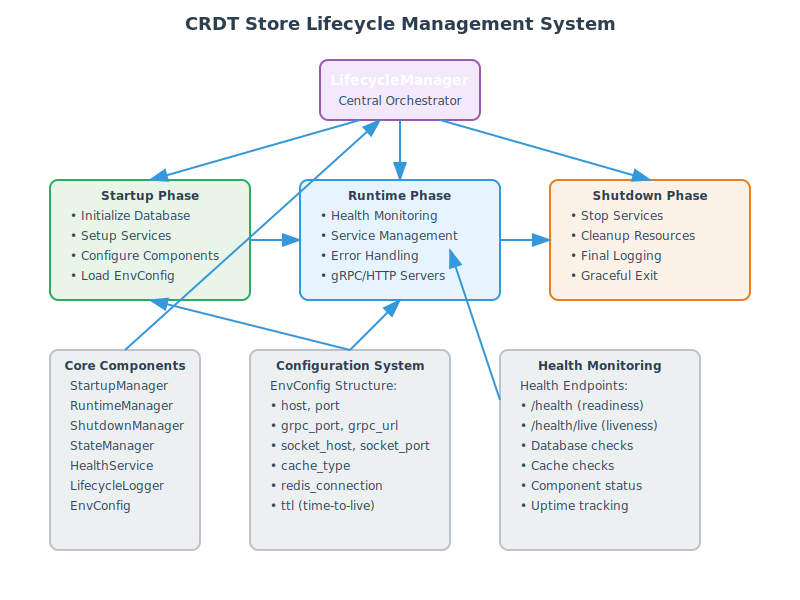
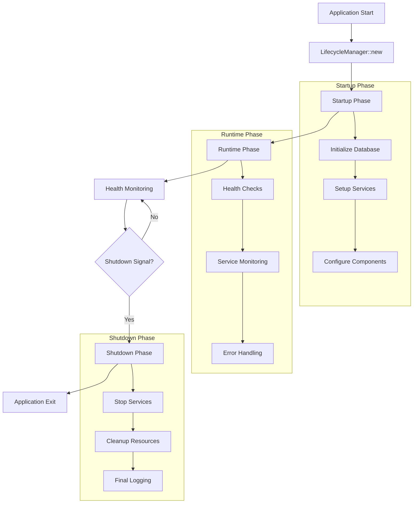

# CRDT Rust Implementation

A Rust implementation of Conflict-Free Replicated Data Types (CRDTs) using Merkle trees and Hybrid Logical Clocks.

## Project Structure

```plaintext
crdt-workspace/
├── .env-sample                    # Environment configuration template
├── .gitignore                     # Git ignore patterns
├── Cargo.toml                     # Workspace configuration
├── Makefile                       # Build automation and development commands
├── README.md                      # Project documentation
├── bin/                           # Binary applications
│   ├── main/                      # Main executable application
│   │   ├── Cargo.toml
│   │   └── src/
│   │       ├── lib.rs
│   │       └── main.rs
│   ├── server/                    # Server application
│   │   ├── Cargo.toml
│   │   ├── Dockerfile
│   │   ├── build.rs
│   │   ├── migrations/            # Server database migrations
│   │   └── src/
│   │       ├── controllers/       # API controllers
│   │       ├── db/               # Database connections
│   │       ├── models/           # Data models
│   │       ├── schema/           # Database schema definitions
│   │       └── sync/             # Synchronization logic
│   └── store/                     # Store application (main CRDT implementation)
│       ├── Cargo.toml
│       ├── Dockerfile
│       ├── docker-compose.yml     # Development services (TimescaleDB, Redis)
│       ├── migrations/            # Store database migrations
│       └── src/
│           ├── builders/          # Code generation and build tools
│           │   └── generator/     # Schema and proto generators
│           ├── constants/         # Application constants and paths
│           ├── controllers/       # gRPC and API controllers
│           ├── database/          # Database schema and operations
│           │   └── schema/        # Database schema definitions
│           │       ├── tables/    # Individual table definitions
│           │       ├── hypertables.rs
│           │       └── init.sql
│           ├── generated/         # Auto-generated code (do not edit manually)
│           │   ├── models/        # Generated data models
│           │   ├── proto/         # Generated protobuf files
│           │   ├── schema.rs      # Generated database schema
│           │   ├── table_enum.rs  # Generated table enumerations
│           │   └── grpc_controller.rs
│           ├── initializers/      # Application initialization
│           ├── lifecycle/         # Application lifecycle management
│           │   ├── manager.rs     # Main lifecycle orchestrator
│           │   ├── startup.rs     # Startup phase management
│           │   ├── runtime.rs     # Runtime phase management
│           │   ├── shutdown.rs    # Shutdown phase management
│           │   ├── state.rs       # State management and transitions
│           │   ├── health_service.rs # Health monitoring service
│           │   └── logging.rs     # Lifecycle logging system
│           ├── middlewares/       # Request/response middleware
│           ├── providers/         # Service providers
│           ├── structs/          # Data structures and configuration
│           │   ├── core.rs     # Core structures including EnvConfig
│           │   └── ...           # Other specialized structures
│           └── utils/            # Utility functions
├── libs/                          # Shared libraries
│   ├── hlc/                      # Hybrid Logical Clock implementation
│   │   ├── Cargo.toml
│   │   └── src/lib.rs
│   └── merkle/                   # Merkle Tree implementation
│       ├── Cargo.toml
│       ├── proto/tree.proto      # Merkle tree protobuf definitions
│       └── src/lib.rs
├── mcp-proto-generator/          # MCP protocol buffer generator
├── scripts/                      # Development and deployment scripts
│   ├── post-checkout            # Git hook scripts
│   ├── pre-push
│   └── setup-hooks.sh
└── tests/                        # Integration tests
```

### Key Directories Explained

- **`bin/store/`** - The main CRDT store implementation with gRPC API
- **`bin/server/`** - Additional server functionality
- **`libs/`** - Reusable libraries (HLC and Merkle tree implementations)
- **`bin/store/src/generated/`** - Auto-generated code from schema and proto definitions
- **`bin/store/src/database/schema/tables/`** - Individual table schema definitions
- **`bin/store/migrations/`** - Database migration files
- **`bin/store/src/builders/generator/`** - Code generation tools and scripts
- **`bin/store/src/constants/paths.rs`** - Centralized path constants for consistency
- **`bin/store/src/lifecycle/`** - Application lifecycle management system
- **`bin/store/src/structs/core.rs`** - Centralized configuration management (EnvConfig)

### Path Management

The project uses centralized path constants defined in `bin/store/src/constants/paths.rs` to ensure consistency across all components. This file contains:

- **Database paths** - Schema files, models, migrations, and table definitions
- **Generated code paths** - Proto files, gRPC controllers, and auto-generated models
- **Build script paths** - Code generation and build automation scripts

When adding new features or modifying existing ones, always reference these constants rather than hardcoding paths to maintain consistency and ease of maintenance.

### Lifecycle Management System

The application uses a comprehensive lifecycle management system located in `bin/store/src/lifecycle/` that orchestrates all phases of the application's execution:

- **`manager.rs`** - Main lifecycle orchestrator that coordinates all components
- **`startup.rs`** - Handles application initialization and startup procedures
- **`runtime.rs`** - Manages the main execution phase and health monitoring
- **`shutdown.rs`** - Coordinates graceful shutdown procedures
- **`state.rs`** - Manages application state transitions and component status
- **`health_service.rs`** - Provides health monitoring and reporting capabilities
- **`logging.rs`** - Specialized logging system for lifecycle events

#### Lifecycle Architecture



*Figure: CRDT Store Lifecycle Management System - Visual representation of the application's startup, runtime, and shutdown phases with their core components and interactions.*

#### Lifecycle Phases


```mermaid
graph TD
    A[Application Start] --> B[LifecycleManager::new]
    B --> C[Startup Phase]
    C --> D[Runtime Phase]
    D --> E[Health Monitoring]
    E --> F{Shutdown Signal?}
    F -->|No| E
    F -->|Yes| G[Shutdown Phase]
    G --> H[Application Exit]
    
    subgraph "Startup Phase"
        C1[Initialize Database]
        C2[Setup Services]
        C3[Configure Components]
        C --> C1 --> C2 --> C3
    end
    
    subgraph "Runtime Phase"
        D1[Health Checks]
        D2[Service Monitoring]
        D3[Error Handling]
        D --> D1 --> D2 --> D3
    end
    
    subgraph "Shutdown Phase"
        G1[Stop Services]
        G2[Cleanup Resources]
        G3[Final Logging]
        G --> G1 --> G2 --> G3
    end
```

### Configuration Management

The application uses centralized configuration management through the `EnvConfig` structure in `bin/store/src/structs/core.rs`:

- **Centralized Environment Variables** - All environment variable access is centralized through `EnvConfig`
- **Type Safety** - Configuration values are parsed and validated at startup
- **Consistent Access** - All components receive configuration through dependency injection
- **Easy Testing** - Configuration can be easily mocked for testing purposes

#### Key Configuration Fields

- `host` - Application host address
- `port` - HTTP server port
- `grpc_port` - gRPC server port
- `grpc_url` - gRPC server URL
- `socket_host` - WebSocket host
- `socket_port` - WebSocket port
- `cache_type` - Cache implementation type (Redis/In-Memory)
- `redis_connection` - Redis connection string (optional)
- `ttl` - Cache time-to-live duration (optional)

## Prerequisites

Before running the installation, ensure you have the following system requirements:

### Required System Tools

- **make** - Build automation tool (required to run the installer)
- **curl** or **wget** - For downloading dependencies
- **git** - Version control system
- **sudo privileges** - Required for system package installation

### Operating System Support

- **macOS** - Homebrew will be used for package management
- **Linux** - Supports apt-get (Ubuntu/Debian), yum (RHEL/CentOS), and pacman (Arch)
- **Windows** - Chocolatey will be used for package management
- **Docker** - For containerized development (optional)

### Rust Version Requirement

- **Rust 1.86.0** - Specific version required for compatibility
  - The installer will automatically install and verify this version
  - If you have a different version installed, the installer will prompt you to update
  - Manual installation: `rustup install 1.86.0 && rustup default 1.86.0`

### Database Requirements

- **TimescaleDB** - Time-series database built on PostgreSQL (version 12 or higher recommended)
  - On macOS: PostgreSQL will be installed via Homebrew during `make install`, TimescaleDB extension needs to be added separately
  - On Linux: PostgreSQL will be installed via package manager during `make install`, TimescaleDB extension needs to be added separately
  - On Windows: PostgreSQL will be installed via Chocolatey during `make install`, TimescaleDB extension needs to be added separately
  - Manual installation: Ensure PostgreSQL service is running with TimescaleDB extension enabled
  - Default connection: `postgresql://localhost:5432`
  - TimescaleDB installation guide: https://docs.timescale.com/install/

### Docker Compose

- **Docker Compose file** - Located at `bin/store/docker-compose.yml`
- **Services** - Provides TimescaleDB and Redis services for development
- **Usage** - Use `make docker-compose-up` to start services
- **Prerequisites** - Docker Desktop must be installed and running
- **Error Handling** - Automatic Docker daemon checks with clear error messages

#### Troubleshooting Docker Issues

**Docker daemon not running:**

- **macOS/Windows**: Start Docker Desktop application
- **Linux**: Run `sudo systemctl start docker` or `sudo service docker start`

**Container name conflicts:**

- Remove existing containers: `docker rm redis timescaledb`
- Or use: `make docker-compose-down` followed by `make docker-compose-up`

**Permission issues:**

- **Linux**: Add user to docker group: `sudo usermod -aG docker $USER`
- **macOS/Windows**: Ensure Docker Desktop has proper permissions

### Network Requirements

- Internet connection for downloading Rust toolchain and dependencies
- Access to crates.io and GitHub for package downloads

### Windows-Specific Requirements

- **PowerShell** - Required for running Windows installation scripts
- **Administrator privileges** - May be required for Chocolatey installation
- **Windows 10/11** - Recommended for best compatibility
- **.NET Framework** - Will be installed automatically with Chocolatey if needed

## Quick Setup

### Step 1: Clone the Repository

First, clone the project repository:

```bash
git clone https://gitlab.platform.dnadev.net/platform/db/crdt/rust/crdt-workspace.git
cd crdt-workspace
```

### Step 2: Configure Git Remote (Optional)

If you plan to push changes to your own repository, update the git remote URL:

```bash
# Remove the original remote
git remote remove origin

# Add your own repository as the new origin
git remote add origin <your-repository-url>

# Verify the new remote
git remote -v
```

### Step 3: Environment Configuration

Set up your environment variables by copying the sample file:

```bash
cp .env-sample .env
```

Then edit the `.env` file to configure your specific settings (database URLs, API keys, etc.).

### Step 4: One-Command Installation

🚀 **After setting up the environment, install the entire project with just one command:**

```bash
make install
```

**Note for Windows users:** The installer will automatically detect your Windows environment and use PowerShell with Chocolatey for package management. Ensure you have administrator privileges if prompted.

This will automatically:

- **Set up environment** by copying `.env-sample` to `.env`
- **Install Rust 1.86.0** (rustc, cargo, rustup) with version verification
- **Install PostgreSQL** database server (version 14 on Windows, latest on macOS/Linux) - TimescaleDB extension needs to be added separately
- **Install Cargo tools**: cargo-make, cargo-watch, diesel_cli
- **Install Protocol Buffers** compiler
- **Setup Git hooks** for development workflow
- **Configure environment** and dependencies
- **Install platform-specific package managers** (Homebrew on macOS, Chocolatey on Windows)
- **Start Docker Compose services** (TimescaleDB and Redis) for development with automatic Docker daemon checks and comprehensive error handling
- **Detect platform** and use appropriate package manager

### Verify Installation

After installation, verify everything is working on any supported platform:

```bash
make verify-install
```

This command will check:

- Rust 1.86.0 installation and version
- PostgreSQL server availability (TimescaleDB extension should be installed separately)
- Required Cargo tools (cargo-make, cargo-watch, diesel_cli)
- Platform-specific dependencies

### Start Development

🚀 **Start the store in development mode:**

```bash
make store
```

## Manual Prerequisites (if not using installer)

### Build Tools

- **make** - Build automation tool
  - macOS: `xcode-select --install` or `brew install make`
  - Ubuntu/Debian: `sudo apt-get install build-essential`
  - CentOS/RHEL: `sudo yum groupinstall "Development Tools"`
  - Arch Linux: `sudo pacman -S base-devel`
  - Windows: Install via Chocolatey `choco install make` or use WSL

### Rust Toolchain

- **Rust 1.86.0** (specific version required for compatibility)

  ```bash
  # Install rustup if not already installed
  curl --proto '=https' --tlsv1.2 -sSf https://sh.rustup.rs | sh

  # Install and set Rust 1.86.0 as default
  rustup install 1.86.0
  rustup default 1.86.0
  ```

### Database

- **TimescaleDB** (PostgreSQL with TimescaleDB extension, version 12 or higher)
  - macOS: `brew install postgresql` then add TimescaleDB extension
  - Ubuntu/Debian: `sudo apt-get install postgresql postgresql-contrib` then add TimescaleDB extension
  - Windows: `choco install postgresql14` then add TimescaleDB extension
  - TimescaleDB installation: Follow the official guide at https://docs.timescale.com/install/

### Cargo Tools

- **cargo-make**: `cargo install cargo-make`
- **cargo-watch**: `cargo install cargo-watch`
- **diesel_cli**: `cargo install diesel_cli --no-default-features --features postgres`

## Getting Started (Manual Setup)

1. Clone the repository:

   ```bash
   git clone <your-repository-url>
   cd crdt-workspace
   ```

2. Install dependencies:

   ```bash
   make install
   ```

3. Start store in development mode:

   ```bash
   make store
   ```

## Available Make Commands

The project includes a comprehensive Makefile with the following commands:

### Setup & Installation

- `make install` - One-command installer for all dependencies (auto-detects macOS/Linux/Windows)
- `make install-macos` - Install dependencies specifically for macOS with Rust 1.86.0
- `make install-linux` - Install dependencies specifically for Linux with Rust 1.86.0
- `make install-windows` - Install dependencies specifically for Windows with Rust 1.86.0
- `make verify-install` - Verify that all required tools are installed (cross-platform)
- `make setup-hooks` - Setup git hooks for code quality

### Development

- `make dev` - Run both server and store in parallel
- `make server` - Run the server only
- `make store` - Run the store only
- `make store-watch` - Run store in watch mode with debug
- `make store-clean-setup` - Run store clean setup

### Store Generators

- `make store-generate-schema` - Generate store schema
- `make store-generate-proto` - Generate store proto files

### Initializer

- `make store-initialize-device` - Initialize device and wait for PostgreSQL listener

### Production

- `make store-build` - Build store in release mode
- `make store-prod` - Run store in production mode

### Database Management

- `make db-migrate-generate NAME=migration_name` - Generate new migration
- `make db-migrate-up` - Run database migrations
- `make db-migrate-revert` - Revert last migration

### Code Quality

- `make fmt` - Format Rust code across all projects
- `make fmt-check` - Check code formatting across all projects

### Git & Version Control

- `make git-cleanup` - Clean up local branches that no longer exist on remote

### Docker Compose Commands

- `make docker-compose-up` - Start TimescaleDB and Redis services using Docker Compose
- `make docker-compose-down` - Stop and remove Docker Compose services
- `make docker-compose-restart` - Restart Docker Compose services
- `make docker-compose-logs` - Show logs from Docker Compose services
- `make docker-compose-ps` - Show status of Docker Compose services

### Utilities

- `make clean` - Clean build artifacts
- `make help` - Show all available commands

For a complete list of commands, run:

```bash
make help
```

## Development Workflow

1. Create a new branch for your feature or bug fix:

   ```bash
   git checkout -b feature/feature-name
   ```

2. Make your changes in the appropriate component:

   - **HLC (Hybrid Logical Clock) changes** go in `libs/hlc/`
   - **Merkle Tree changes** go in `libs/merkle/`
   - **Main application changes** go in `bin/main/`
   - **Server application changes** go in `bin/server/`
   - **Store application changes** (CRDT implementation) go in `bin/store/`
   - **Schema definitions** go in `bin/store/src/database/schema/tables/`
   - **Generated code** is automatically created in `bin/store/src/generated/`
   - **Lifecycle management changes** go in `bin/store/src/lifecycle/`
   - **Configuration changes** go in `bin/store/src/structs/core.rs`

3. Format your code:

   ```bash
   cargo fmt
   ```

## Guidelines in Adding a New Schema

1. Create or Update necessary files

   #### Creating a new table schema

   - Create a new file in the schema tables directory:
     `bin/store/src/database/schema/tables/<table_name>.rs`

     Note: Can copy from existing table file and rename the file.

   #### Adding a new field to existing table schema

   - Update the table file from this directory: `bin/store/src/database/schema/tables/`

   #### Overriding a system table schema

   - If target table to create is a system table defined in system tables, which is inaccessible to client requests.

     1. Create a new file in the schema tables directory: `bin/store/src/database/schema/tables/<table_name>.rs`

        - Copy an existing table file or refer from the example below or better use an AI to generate the whole file and add an example table file as code base format.
        - Refer the system table schema of its fields from the generated schema file: `bin/store/src/generated/schema.rs`
        - Carefully update the table file, its proper naming of table and fields, and the assigning of data types.
        - Set the indices properly, with a unique name, formatted as `idx_<table_name>_<column_name>`.
        - Set the foreign keys properly, with a unique name, formatted as `fk_<table_name>_<column_name>`.

     2. Remove the table from the system_tables file if it exists there

   Key Requirements:

   - Carefully check and update the necessary names in the file if copied.
   - Table name should be in `snake case` and `pluralized`.
   - Set the indices properly, with a unique name, formatted as `idx_<table_name>_<column_name>`.
   - Set the foreign keys properly, with a unique name, formatted as `fk_<table_name>_<column_name>`.

   Example:

   ```rust
     use crate::schema::generator::diesel_schema_definition::{
         DieselTableDefinition, types::*
     };
     use crate::define_table_schema;
     use crate::{system_fields, system_indexes, system_foreign_keys};

     pub struct SamplesTable;

     define_table_schema! {
         hypertable: false,
         fields: {
             // System fields - common across all tables
             system_fields!(),

             // Samples table specific fields
             sample_text: nullable(text()),
             sample_char: nullable(varchar(Some(300))),
             sample_number: nullable(integer()), default: 0, migration_nullable: false,
             sample_object: nullable(jsonb()),
             is_sample_boolean: nullable(boolean()),
             sample_with_reference_id: nullable(text()),
         },
         indexes: {
             // System field indexes
             system_indexes!("samples"),

             idx_samples_sample_text: {
                 columns: ["sample_text"],
                 unique: false,
                 type: "btree"
             },
         },
         foreign_keys: {
             // System foreign keys
             system_foreign_keys!("samples"),

             // Custom foreign keys
             fk_samples_sample_with_reference_id: {
                 columns: ["sample_with_reference_id"],
                 foreign_table: "account_signatures",
                 foreign_columns: ["id"],
                 on_delete: "no action",
                 on_update: "no action"
             }
         }
     }
   ```

2. Git add and commit the changes with a proper commit message to track the changes on the files.

   **Why we need to git add and commit:**

   - **Version Control**: Track all changes made to schema files for historical reference
   - **Change Documentation**: Maintain a clear record of what was modified, when, and why
   - **Rollback Capability**: Enable reverting to previous working states if issues arise
   - **Conflict Resolution**: Provide restore points when merge conflicts or errors occur
   - **Team Collaboration**: Allow multiple developers to track and understand schema evolution
   - **Migration Safety**: Ensure schema changes are properly versioned before running migrations
   - **Debugging**: Help identify when and where issues were introduced in the schema
   - **Deployment Tracking**: Maintain synchronization between code changes and database migrations

3. Run command for schema generation.

   ```bash
   make store-generate-schema
   ```

   Note:

   - You have to enter migration name for the migration file to be created, format will be in `snake case`, better to have standard naming for your migrations files.
   - Migrations generated will be stored in this directory: `bin/store/migrations`

4. Verify generated files:

   - Check the migration file in the migrations directory: `bin/store/migrations/`
   - Check the table model file in the generated models directory: `bin/store/src/generated/models/<table_name>_model.rs`, the sorting of fields must be the same with the sorting on the schema in the generated schema file: `bin/store/src/generated/schema.rs`
   - Check the generated schema file: `bin/store/src/generated/schema.rs`, the table schema must be added to the file.

5. Run command for migration.

   ```bash
   make db-migrate-up
   ```

6. Git add and commit the changes with a proper commit messages, to track and secure the changes.

   **Why we need to git add and commit:**

   - **Version Control**: Track all changes made to schema files for historical reference
   - **Change Documentation**: Maintain a clear record of what was modified, when, and why
   - **Rollback Capability**: Enable reverting to previous working states if issues arise
   - **Conflict Resolution**: Provide restore points when merge conflicts or errors occur
   - **Team Collaboration**: Allow multiple developers to track and understand schema evolution
   - **Migration Safety**: Ensure schema changes are properly versioned before running migrations
   - **Debugging**: Help identify when and where issues were introduced in the schema
   - **Deployment Tracking**: Maintain synchronization between code changes and database migrations

7. Run command for store proto file generation.

   ```bash
   make store-generate-proto
   ```

8. Verify generated files:

   - Check the generated table enum file: `bin/store/src/generated/table_enum.rs`
   - Check the generated gRPC controller file: `bin/store/src/generated/grpc_controller.rs`
   - Check the generated store.rs file: `bin/store/src/generated/store.rs`
   - Check the generated store.proto file: `bin/store/src/generated/proto/store.proto`

9. Run command to check the code.

   ```bash
   cargo check
   ```

10. Run command to format code.

    ```bash
    make fmt
    ```

11. Run command to check the code format.

    ```bash
    make fmt-check
    ```

12. Git add and commit the changes with a proper commit message, to track and secure the changes.

    **Why we need to git add and commit:**

    - **Version Control**: Track all changes made to schema files for historical reference
    - **Change Documentation**: Maintain a clear record of what was modified, when, and why
    - **Rollback Capability**: Enable reverting to previous working states if issues arise
    - **Conflict Resolution**: Provide restore points when merge conflicts or errors occur
    - **Team Collaboration**: Allow multiple developers to track and understand schema evolution
    - **Migration Safety**: Ensure schema changes are properly versioned before running migrations
    - **Debugging**: Help identify when and where issues were introduced in the schema
    - **Deployment Tracking**: Maintain synchronization between code changes and database migrations

13. Run command to run the store.
    ```bash
    make store
    ```

## Contributing Guidelines

1. Follow Rust's coding conventions
2. Write clear commit messages
3. Include tests for new functionality
4. Update documentation as needed
5. Make sure all tests pass before submitting PR
