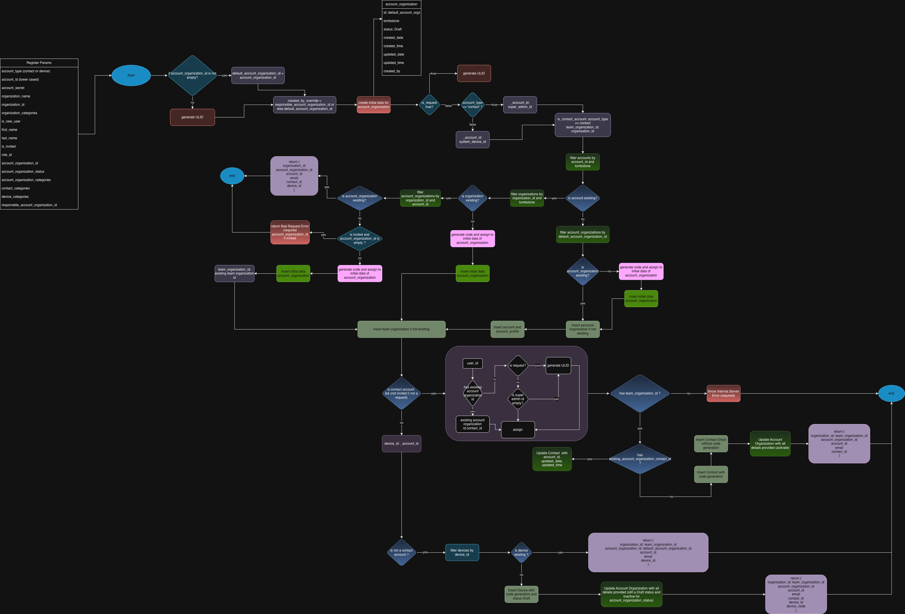

# Organizations registration (register)

This module handles registration of **accounts**, **organizations**, and related entities (`account_organizations`, `contacts`, `devices`) for the store. The main entry point is the `register` function in [organization_service.rs](organization_service.rs).

---

## Registration flow diagram



## Overview

**Code:** [organization_service.rs](organization_service.rs) (`register`, `create_new_organization_if_not_exists`, `create_account`)  
**Request struct:** [structs.rs](structs.rs) (`Register`, `AccountType`)

The `register` function:

- Creates or reuses an **Account** (`accounts` table).
- Creates or reuses a **personal organization** for the account.
- Creates or reuses a **team organization** (the organization the account is joining).
- Links the account to the organization via **AccountOrganization** (`account_organizations` table).
- Optionally creates/updates a **Contact** and **ContactEmail** for contact accounts.
- Optionally creates/updates a **Device** for device accounts.
- Returns a JSON payload with the IDs you need for subsequent API calls.

Registration always runs through the CRDT sync pipeline by inserting/updating rows via `sync_service::insert` / `sync_service::update`, so changes are picked up by sync.

---

## Function signature

From [organization_service.rs](organization_service.rs#L64-L68):

```rust
pub async fn register(
    params: &Register,
    is_request: Option<bool>,
    _account_organization_id: Option<String>,
) -> Result<Value, ApiError>
```

- `params`: Deserialized payload with all registration data (see [Register](#register-struct)).
- `is_request`:
  - `Some(true)`: registration is a **pending request** (e.g. invited device or account that will be activated later).
  - `None` / `Some(false)`: normal registration.
- `_account_organization_id`: legacy parameter (not used in the implementation); the effective account_organization id is taken from `params.account_organization_id` or generated as a ULID.

The function returns a `serde_json::Value` with the created/reused identifiers.

---

## Register struct

Defined in [structs.rs](structs.rs):

```rust
pub struct Register {
    pub account_type: Option<AccountType>,      // "contact" (default) or "device"
    pub organization_name: Option<String>,      // team organization name
    pub organization_id: Option<String>,        // optional existing team org id
    pub account_id: String,                     // login/email identifier (lowercased)
    pub account_secret: String,                 // password or device secret
    pub is_new_user: Option<bool>,              // defaults to true
    pub first_name: String,
    pub last_name: String,
    pub is_invited: Option<bool>,               // invited vs direct signup
    pub role_id: Option<String>,                // role for account_organization
    pub account_organization_status: Option<String>,
    pub account_organization_categories: Option<Vec<String>>,
    pub account_organization_id: Option<String>,          // existing AO id if provided
    pub contact_categories: Option<Vec<String>>,          // contact tags, default ["Contact"]
    pub device_categories: Option<Vec<String>>,           // device tags
    pub responsible_account_organization_id: Option<String>, // used for created_by
    pub initial_personal_organization_id: Option<String>, // initializer hook for personal org id
    // plus legacy/deprecated fields (id, name, email, password, parent_organization_id, code, categories, organization_categories, account_status, contact_id)
}
```

For new integrations, focus on the highlighted fields above; legacy fields are accepted for backward compatibility but not required.

---

## High-level flow

### 1. Resolve defaults and flags

- Loads default IDs from environment (`EnvConfig::default()`), including:
  - `super_admin_id`: default account id for contact registrations when `is_request = false`.
  - `system_device_ulid`: default account id for device registrations when `is_request = false`.
- Normalizes:
  - `account_type` → `AccountType::Contact` or `AccountType::Device` (default contact).
  - `account_id` → lowercased.
  - `is_new_user`, `is_invited` with sensible defaults.
- Computes `default_account_organization_id`:
  - Use `params.account_organization_id` when provided and non-empty.
  - Otherwise generate a new ULID.
- Computes `created_by_override` as:
  - `params.responsible_account_organization_id` if non-empty, else `default_account_organization_id`.

### 2. Ensure Account and personal organization

1. Look up an existing `Account` by `account_id` (`accounts.account_id`, `tombstone = 0`).
2. If the account **exists**:
   - Reuse its `id` as `_account_id`.
3. If the account **does not exist**:
   - Ensure a draft `AccountOrganization` exists with `default_account_organization_id` (generates a code once if inserting).
   - Create a **personal organization** via `create_new_organization_if_not_exists` with:
     - Name: `"Personal Organization"`.
     - Categories: `["Personal"]`.
     - Optional `initial_personal_organization_id` if provided.
   - Call `create_account` to:
     - Insert into `accounts` with a generated code (`helpers::generate_code("accounts")`).
     - Associate the new account to the personal organization.
     - Hash and store the password (`auth_service::password_hash`).
     - Optionally create an account profile.

### 3. Ensure team organization

- Derive `team_categories`:
  - Use `params.organization_categories` when present.
  - Otherwise default to `["Team"]`.
- Resolve `team_organization_id` via `create_new_organization_if_not_exists` using:
  - `organization_name` or empty string.
  - `team_categories`.
  - Optional `params.organization_id` as the desired id.
  - `created_by_override` as `created_by`.
- The helper:
  - Reuses an existing organization if it already exists with the given id.
  - Otherwise inserts a new row with:
    - Generated `code` via `helpers::generate_code("organizations")` (or ULID fallback).
    - `status = "Active"`, `tombstone = 0`, timestamps, and `created_by = responsible_account_organization_id`.

### 4. Existing account + team org membership

When the account already exists:

- If the requested team organization (`organization_id`) exists and the account is already linked via `account_organizations`:
  - Registration is a **no-op**; returns the existing `account_organization` / `contact_id` / `device_id`.
- If the team organization exists but there is **no** `account_organizations` row yet:
  - Validates that invited registrations (`is_invited = true`) with existing account must provide `account_organization_id` (otherwise returns `400`).
  - Inserts a new `account_organizations` row for this account + organization, generating a `code` once.
- If the team organization does not exist yet:
  - Inserts a new `account_organizations` row for the pending membership and then proceeds to organization creation.

### 5. Contact account flow (AccountType::Contact)

When `account_type = "contact"` and `!is_invited || !is_request`:

- Resolves `user_id`:
  - If there is a draft `account_organizations` row with a non-empty `contact_id`, reuse it.
  - Otherwise:
    - If `is_request = true`: generate a new ULID.
    - Else if `super_admin_id` is empty: generate a new ULID.
    - Else: use `super_admin_id`.
- If reusing `contact_id`:
  - Updates the `contacts` row to attach `account_id`, `updated_date`, `updated_time`.
- Otherwise:
  - Creates a new `Contact` with:
    - `organization_id = team_organization_id`.
    - `categories = contact_categories` or `["Contact"]`.
    - Generated `code` via `helpers::generate_code("contacts")`.
    - `status = "Active"`, `tombstone = 0`, timestamps, `created_by = created_by_override`.
  - Creates a primary `ContactEmail` row with:
    - `email = account_id`.
    - `organization_id = team_organization_id`.
- Updates `account_organizations` to:
  - Attach `email`, `account_id`, `organization_id`, `contact_id`, `role_id`.
  - Set `categories` from `account_organization_categories` or `["Internal User"]`.
  - Set `account_organization_status` (default `"Active"`).
  - Mark `status = "Active"`, `tombstone = 0`.
  - Keep `id = default_account_organization_id`.
- Returns JSON:

```json
{
  "organization_id": "<team_organization_id>",
  "account_organization_id": "<account_organization_id>",
  "account_id": "<account row id>",
  "email": "<account_id>",
  "contact_id": "<contact_id>"
}
```

On failure, logs an error and currently returns an empty JSON object.

### 6. Invited / non-contact flow (AccountType::Device or invited contact)

When `is_contact_account` is false or the account is invited (`is_invited = true && is_request`):

- Initializes `device_id` to `_account_id` (for device accounts) and `device_code = None`.
- If `account_type = "device"`:
  - If a `Device` with this `id` already exists:
    - Returns early with:

```json
{
  "device_id": "<device_id>",
  "organization_id": "<team_organization_id>",
  "account_id": "<account row id>",
  "email": "<account_id>",
  "account_organization_id": "<account_organization_id>"
}
```

  - Otherwise creates a new `Device` with:
    - `organization_id = team_organization_id`.
    - `categories = device_categories`.
    - Generated `code` via `helpers::generate_code("devices")`.
    - `status = "Draft"` (for pending devices), `tombstone = 0`, timestamps, `created_by = created_by_override`.
  - Persists via `sync_service::insert` and stores `device_code` from the model.

- Updates `account_organizations` to:
  - Attach `email`, `account_id`, `organization_id`.
  - Attach `device_id` for non-contact accounts.
  - Set `account_organization_status` and `status`:
    - If device + `is_request = true`: `account_organization_status = "Inactive"`, `status = "Draft"`.
    - Otherwise: use provided `account_organization_status` or `"Active"`, and `status = "Active"`.
  - Preserve existing `created_date`/`created_time` (update only `updated_*`).
- Returns JSON:

```json
{
  "organization_id": "<params.organization_id or created id>",
  "account_organization_id": "<account_organization_id>",
  "account_id": "<account row id>",
  "email": "<account_id>",
  "contact_id": "<contact_id if any>",
  "device_id": "<device_id if created or reused>",
  "device_code": "<device_code if created>"
}
```

On failure, logs an error and returns an empty JSON object.

---

## Error handling and invariants

- Returns `400 Bad Request` when:
  - An invited registration with an existing account is missing `account_organization_id`.
- Returns `500 Internal Server Error` for:
  - Serialization failures when building JSON payloads.
  - Missing required IDs (e.g. `device_id` resolution failures).
  - Unexpected DB errors when checking existence or updating records.
- Invariants:
  - `account_organizations.id` is stable and reused across updates.
  - Codes for `accounts`, `organizations`, `contacts`, `devices` are always generated via `helpers::generate_code(...)` (backed by the remote counter-service).
  - `tombstone = 0` for all freshly created rows.
  - All writes go through `sync_service`, so they participate in CRDT sync.

---

## How to call register (API controller)

The HTTP controller wraps `register` and typically:

- Deserializes the JSON body into `Register`.
- Passes `is_request` depending on route semantics:
  - Immediate signup: `is_request = Some(false)` or `None`.
  - Pending invite or provisioning: `is_request = Some(true)`.
- For contact accounts (default):

```json
{
  "account_type": "contact",
  "account_id": "user@example.com",
  "account_secret": "PlaintextPassword",
  "first_name": "Jane",
  "last_name": "Doe",
  "organization_name": "Team Org",
  "organization_id": null,
  "is_new_user": true,
  "is_invited": false,
  "role_id": "role-admin",
  "account_organization_categories": ["Internal User"],
  "contact_categories": ["Contact"]
}
```

- For device accounts:

```json
{
  "account_type": "device",
  "account_id": "device-001@example.com",
  "account_secret": "DeviceSecret",
  "first_name": "System",
  "last_name": "Device",
  "organization_name": "Team Org",
  "organization_id": null,
  "is_new_user": true,
  "is_invited": true,
  "device_categories": ["System"]
}
```

The response provides the identifiers you should persist on the client side for subsequent API calls (e.g. `account_organization_id`, `organization_id`, `device_id`, `contact_id`).
